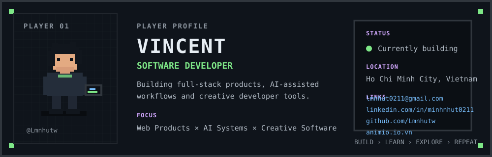
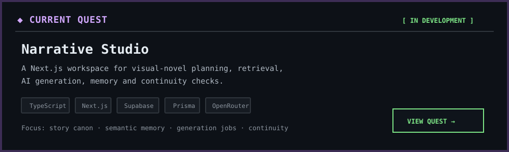
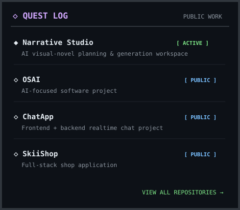
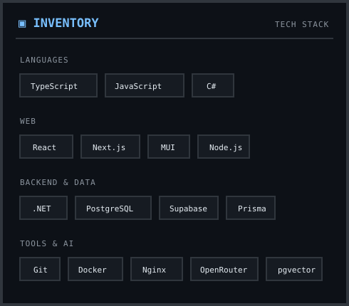
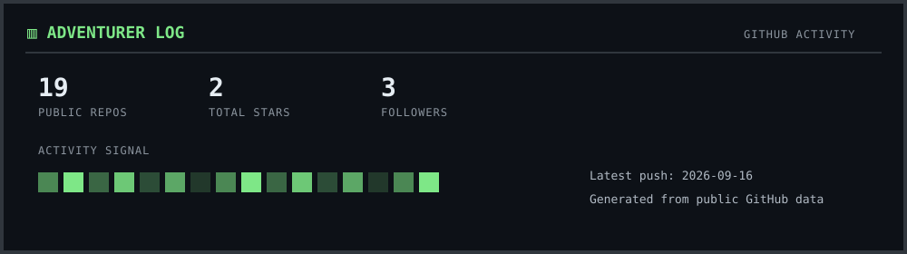
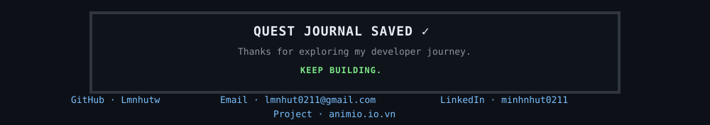

  

  <a href="https://github.com/Lmnhutw"><b>GitHub</b></a>
  &nbsp;•&nbsp;
  <a href="mailto:lmnhut0211@gmail.com"><b>Email</b></a>
  ·
  <a href="https://www.linkedin.com/in/minhnhut0211/"><b>LinkedIn</b></a>
  ·
  <a href="https://animio.io.vn/"><b>Animio</b></a>

  

<table>
<tr>
<td width="50%" valign="top">
  
</td>
<td width="50%" valign="top">
  
</td>
</tr>
</table>

  

  

